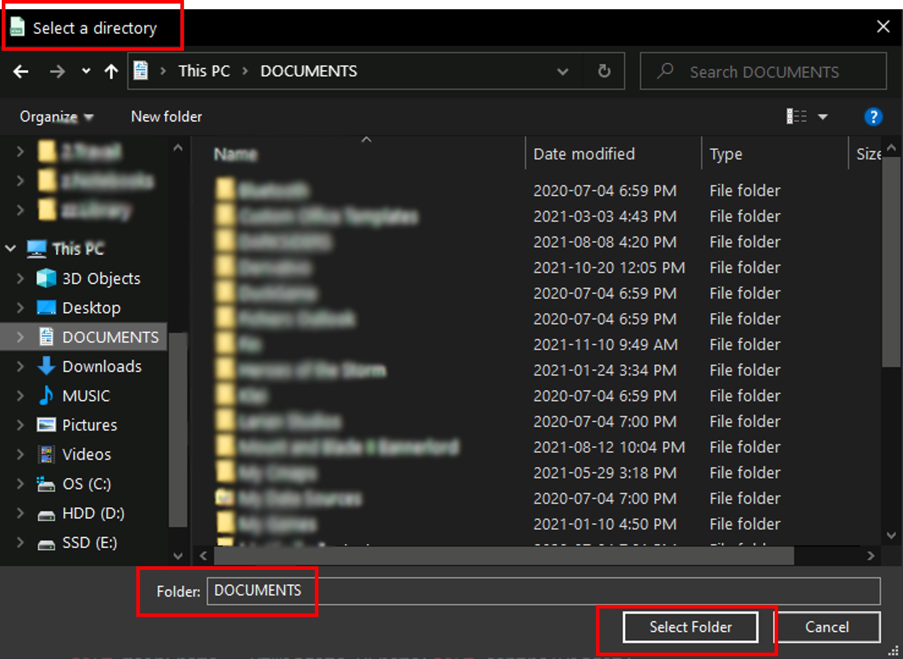

# ExcelQueryFormatter

## What is this for?
The ExcelQueryFormatter is as short script allowing to filter and order the columns of an *original* Excel file (.xlsx) based on a *model* Excel file with the desired output format. Basic assertions are made to ensure files are of the type .xlsx.

This script is packaged with a GUI built using PyQT5 to allow the user to quickly select the *input* and *model* files from the file manager. The app is packaged as an executable (.exe) with all the necessary dependencies for easy distribution. The executable has proper app display name on windows, and an icon to make it recognizable.

## Motivation
While I was working in a corporate environment (~July 2020), a colleague would ask me to validate files with 200+ columns every month. I developped this tool on my personal time to enable her to this task quickly and on her own. She was grateful, and very happy with this surprise :)

# How-to
The menu should almost self-explanatory.
1. Select *Original* file to format

2. Select *Model* file to be formatted
3. Select the output directory

4. Select the name of the output
5. Press *Format*
6. Voilà !
